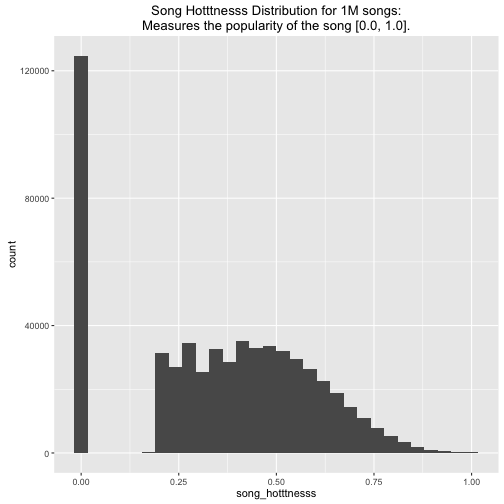
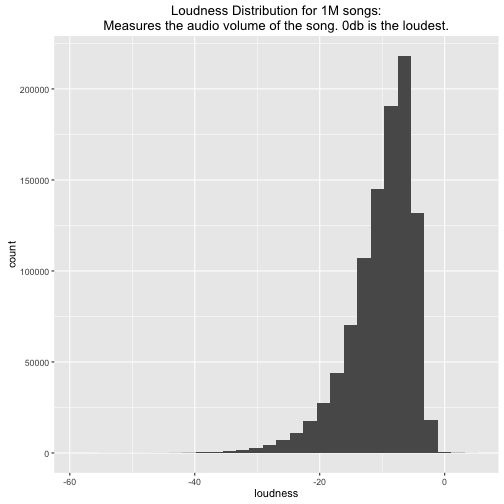
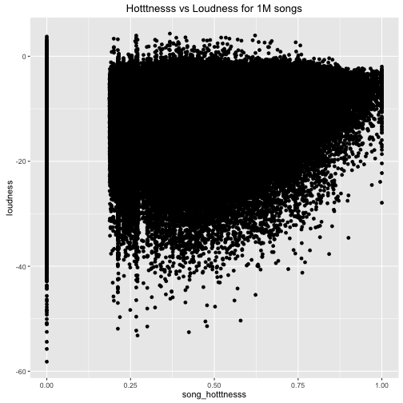

## Goals

- Analyze the [Million Song Dataset](http://labrosa.ee.columbia.edu/millionsong/)
- Create a song recommender using metadata from the [Million Song Dataset](http://labrosa.ee.columbia.edu/millionsong/).  
- Create a song recommender demo using [R and Shiny](http://shiny.rstudio.com/)

--- .class #id

## Getting and Cleaning the Data

- The entire dataset is 280GB and Stored in Amazon S3 in [HDF5](https://www.hdfgroup.org/HDF5/) format.
- We extracted some HDF5 fields to a serialized R file containing the features.


```r
df <- readRDS("data/songs.rds")
names(df)
```

```
##  [1] "artist_name"               "title"                    
##  [3] "release"                   "song_hotttnesss"          
##  [5] "tempo"                     "loudness"                 
##  [7] "energy"                    "danceability"             
##  [9] "duration"                  "artist_familiarity"       
## [11] "artist_hotttnesss"         "artist_latitude"          
## [13] "artist_location"           "artist_longitude"         
## [15] "end_of_fade_in"            "key"                      
## [17] "key_confidence"            "song_id"                  
## [19] "start_of_fade_out"         "time_signature"           
## [21] "time_signature_confidence" "track_id"
```

--- &twocol
## Feature Selection


*** =left




*** =right



--- &twocol

## Recommender

*** =left

- We use the `song_hotttnesss` and `loudness` as numeric features to model songs in a 2-dimensional space.
- A user can query the recommender by selecting values for `song_hotttnesss` and `loudness`
- The recommender calculates the `5 nearest songs` in the 2D space using a euclidean distance metric. 

*** =right


---

## Shiny Application: Prince Song Recommender

- We built a prototype that uses 25 of the 1 million songs.
- The 25 songs are recorded by [US recording artist 'Prince'](https://en.wikipedia.org/wiki/Prince_(musician\))
- [We built a Shiny App that demonstrates the recommender - Click here to try it!](https://technicalelvis.shinyapps.io/prince_song_recommender/)
